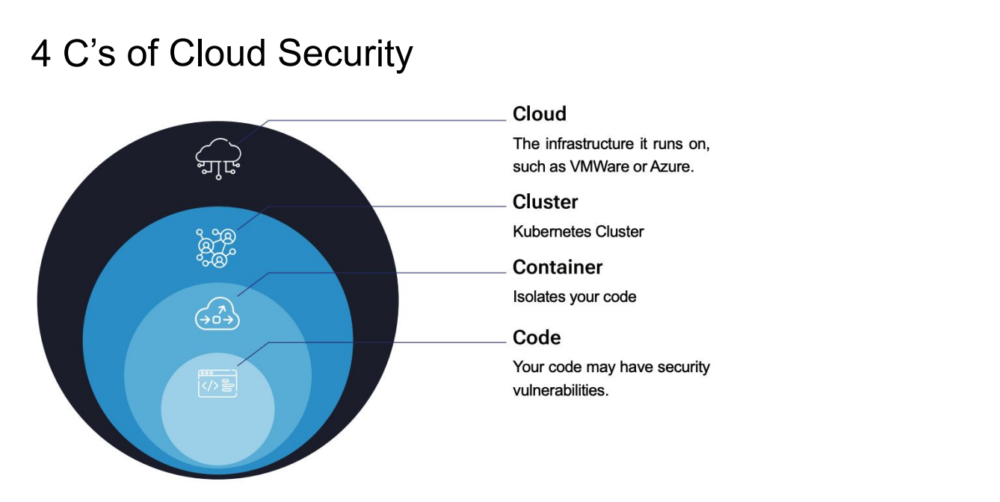

# Kubernetes Security

## Agenda: Modules
1. Kubernetes and Cloud Security Basics
2. Cluster Security
3. Container Security
4. Code Security

---

## Module 1: Kubernetes and Cloud Security Basics

### Agenda
1. Kubernetes Security
2. The 4 C's of Kubernetes Security

### 1. Kubernetes Security

#### Why do we need Security?

- **Example:**
   
  - **Tesla Kubernetes Cryptojacking Incident (2018)**  
      [Article Link](https://arstechnica.com/information-technology/2018/02/tesla-cloud-resources-are-hacked-to-run-cryptocurrency-mining-malware/)
    
  - **What happened:** Attackers exploited an exposed Kubernetes dashboard with no authentication and deployed a cryptomining script inside Tesla's Kubernetes cluster.
      
  - **Consequences:**
      - Unauthorized access to Kubernetes workloads
      - Increased cloud costs due to resource hijacking
      - Potential exposure of sensitive telemetry data
    
- **Conclusion:**
    - Cyberattacks happen everywhere, all the time. A single misconfiguration can lead to data loss, downtime, or financial damage. By applying Kubernetes Security, we can mitigate threats and build a resilient Kubernetes environment.
    - Securing Kubernetes is not about *if* an attack will happen — it’s about being prepared *when* it does.

#### Kubernetes Architecture


#### Kubernetes Security Best Practices

- The Kubernetes API should not be exposed on the internet. Ideally, it is behind a VPN or some other firewalling, and only encrypted traffic is allowed.
- Do not make everyone an administrator. Use **Role-Based Access Control (RBAC)** to limit access.
- Access to the etcd datastore should be strictly limited, configured to use TLS, and encrypted to prevent tampering or data extraction.

### 2. The 4 C's of Kubernetes Security

**Cloud, Cluster, Container, Code**


---

## Module 2: Cluster Security

(Section to be added...)

---

## Module 3: Container Security

### Agenda
1. Containers & Isolation Overview
2. Container Breakout
3. Preventing Container Breakout
4. Using Kubernetes' Built-in Security Features
5. Extending Security with External Tools

### 1. Containers & Isolation Overview

#### Containers
- A container offers an alternative to virtualization. It runs as a process in a host machine and uses various Linux kernel features to isolate the process.

#### Container Isolation
- **cgroup** - Limits CPU/RAM usage, preventing a single container from consuming all system resources.
- **chroot** - Changes the root directory to a subdirectory containing the container’s files, preventing access to the host filesystem.
- **Namespaces** - Ensures users, processes, networks, volume mounts, etc., are isolated to their own containers.

### 2. Container Breakout

#### What is container breakout?
- If an application is given escalated privileges, it could break out of its container and execute commands as if it were a user in the host OS.
- This allows an attacker to escape from a container to the host and move laterally across other containers.
  

#### Example
- A simple way to do this is to run as root and execute Linux kernel commands using a Perl script to change the root directory.
- [Pentest Monkey Chroot Breakout](https://pentestmonkey.net/blog/chroot-breakout-perl)

### 3. Preventing Container Breakout

- Using Kubernetes Security Context

```yaml
apiVersion: v1
kind: Pod
metadata:
  name: security-context-demo
spec:
  securityContext:
    runAsUser: 1000
    runAsGroup: 3000
    fsGroup: 2000
  containers:
    - name: nginx
      image: nginx
      securityContext:
        allowPrivilegeEscalation: false
        privileged: false
        runAsNonRoot: true
```
- Avoid Mounting the Host’s Root Directory.
- Limit Service Account Privileges.
- Limit Linux Kernel Calls (SecComp, AppArmor).
  

```yaml
apiVersion: v1
kind: Pod
metadata:
  name: security-context-capa
spec:
  containers:
    - name: nginx
      image: nginx
      securityContext:
        capabilities:
          add: ["NET_ADMIN", "SYS_TIME"]
```

### 4. Using Kubernetes' Built-in Security Features

#### Pod Security Admissions
- Kubernetes Pod Security Standards define three isolation levels:
    - **Privileged:** Unrestricted, allows privilege escalation.
    - **Baseline:** Minimal restrictions, prevents privilege escalation.
    - **Restricted:** Strong restrictions, follows best practices.

#### Example

```yaml
apiVersion: v1
kind: Namespace
metadata:
  name: default
  labels:
    pod-security.kubernetes.io/enforce: restricted
```

```yaml
# This pod will not be allowed
apiVersion: v1
kind: Pod
metadata:
  name: nginx
spec:
  containers:
  - name: nginx
    image: nginx
```

```yaml
# This pod follows security best practices and is allowed
apiVersion: v1
kind: Pod
metadata:
  name: nginx-secure
spec:
  securityContext:
    runAsNonRoot: true
  containers:
  - name: nginx
    image: nginx
    securityContext:
      allowPrivilegeEscalation: false
      capabilities:
        drop: ["ALL"]
      seccompProfile:
        type: RuntimeDefault
```

#### Network Policies
- Kubernetes Network Policies allow limiting traffic to/from pods.
- Default: Wide open; policies can restrict ingress and egress.
- **Components:**
    - **Pod Selectors:** Determines applicable pods.
    - **Ingress:** Restricts incoming traffic.
    - **Egress:** Restricts outgoing traffic.
- **Sample YAML:** (to be added...)

### 5. Extending Security with External Tools

#### Why do we need External Tools?
- Built-in Kubernetes security features have limitations:
    - Namespace-wide limits.
    - Lack of granular control.
    - Pod security standards may not fit all workloads.

#### Available Tools

- **OPA Gatekeeper** - Enforces policies to validate pods.
  - **Picture:** 

- **kubesec** - Evaluates YAML manifests for security risks.
  - [Kubesec.io](https://kubesec.io/)
  - **Picture:** 
---

## Demo

#### M9Sweeper
```
                    ┌──────────────────────────┐
                    │      M9Sweeper UI        │
                    │    (Dashboard Service)   │
                    └──────────┬──────────────┘
                               │
         ┌─────────────────────▼─────────────────────┐
         │                Trawler                    │
         │  (Security Scanning Engine in M9Sweeper)  │
         └─────────────────────┬─────────────────────┘
                               │
  ┌──────────────┬─────────────┴─────────────┬──────────────┐
  │              │                           │              │
  ▼              ▼                           ▼              ▼
KubeSec     Kube-Bench                   Kube-Hunter     Falco
(Checks     (CIS Benchmark)              (Pen-testing)  (Runtime Sec)
YAMLs)  

    ┌──────────────────────────────────────────────┐
    │  RabbitMQ (Message Queue)                    │
    └──────────────────────────────────────────────┘
                     │
    ┌──────────────────────────────────────────────┐
    │  PostgreSQL (Database for Scan Results)      │
    └──────────────────────────────────────────────┘
```
